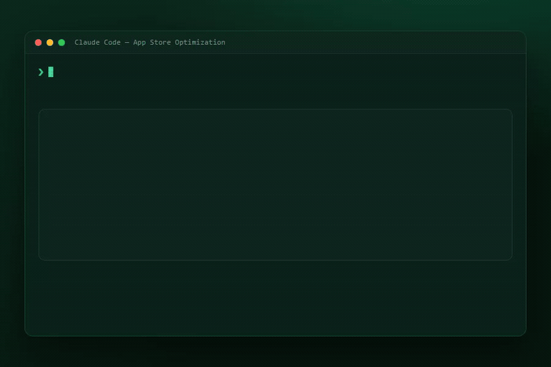

# ASOScan — ASO Skills for Claude, Cursor & any Agent-Skills client

[](LICENSE)


<p align="center">
  
</p>

<p align="center"><em>Real keyword volume, difficulty &amp; competitors — from inside your AI coding agent.</em></p>

Expert **App Store Optimization** in your AI workflow, powered by **real data**
from the [ASOScan](https://asoscan.com/?utm_source=github&utm_medium=skill&utm_campaign=aso-skills&utm_content=readme)
API — live keyword **volume + difficulty**, your app's **rank** (and its
history), **keyword opportunities**, **keyword spy**, **competitor + review**
intelligence, and a **metadata / ASO-score audit**.

Each skill packages a battle-tested ASO framework, a scoring rubric, and an
output template. The agent reads the skill, pulls live numbers from your ASOScan
account, and gives you specific, actionable recommendations — not generic advice.

> Installed from the public repo **`ASOScan/aso-skills`** (GitHub org: ASOScan).

---

## Skills

| Skill | What it does |
|---|---|
| **asoscan-router** | Start here. Reads a natural-language ASO request and routes it to the right skill. Runs first-run key setup. |
| **aso-fundamentals** | Expert ASO best practices, keyword strategy, and golden tips — **works with no API key**. |
| **asoscan-setup** | Guides getting your API key, setting up webhooks (Slack/Teams), and connecting Play Console / App Store — **no API key needed**. |
| **keyword-intelligence** | Volume, difficulty, your rank & rank movement, rank/metrics history, and live keyword research. |
| **keyword-opportunities** | Gap-scored keyword suggestions worth targeting; can start tracking the winners. |
| **keyword-spy** | Reverse-lookup: every keyword an app ranks for (yours or a tracked competitor's). |
| **competitor-analysis** | Compare against tracked competitors; add a rival by store URL; category rank & rating history. |
| **review-insights** | Review sentiment + the top topics, feature requests, and bugs users mention. |
| **metadata-audit** | Audits your listing (title/subtitle/description/keywords) with your ASOScan ASO score and drafts honest improvements. |

---

## What it can answer

Ask in plain language — the router picks the right skill. Examples it handles today:

- **Keyword intelligence** — "What's the volume and difficulty of *habit tracker*?" ·
  "Where do I rank for it, and is it moving?" · "Show my rank history." · "Research *sleep sounds*."
- **Suggestions** — "**Suggest keywords to track for my app.**" · "What keywords am I
  missing vs my competitors?" · "Track these for me."
- **Which keywords to use in the store** — "**Which keywords should I put in my
  title / subtitle / keyword field?**" (finds the terms, then drafts where they go,
  within Apple/Google limits).
- **Keyword spy** — "What keywords does my app rank for?" · "What does *\<a competitor
  I track\>* rank for that I don't?"
- **Competitors** — "Compare me to my competitors." · "**What category do my
  competitors use?**" · "Add *\<store URL\>* as a competitor." · "Am I gaining or
  losing in the category chart?"
- **Listing audit** — "What's my ASO score and how do I raise it?" · "Rewrite my
  subtitle." · "What changed in my listing?"
- **Reviews** — "What are users saying?" · "Top complaints / feature requests / bugs."
- **Learn ASO (no key needed)** — "How does App Store search work?" · "How do I write
  a good subtitle?" · "What's a solid keyword strategy?" · "Screenshot best practices?"
  (answered by **aso-fundamentals**, grounded in Apple/Google docs).
- **Set up & connect (no key needed)** — "How do I get my API key?" · "Set up webhooks
  / send alerts to Slack or Teams." · "Connect my Play Console / App Store app."
  (answered by **asoscan-setup**).

**Scope:** the **data** skills work on the apps in *your* ASOScan account (and
competitors you track) and need an API key; the **aso-fundamentals** and
**asoscan-setup** skills work with no key. To analyze a rival, the skill first adds it
as a competitor by **store URL** (there's no lookup by app name).

**Not yet:** pulling any app's keywords by name without adding it, download/revenue
estimates, Apple's secondary category, or generating listing copy without your data.

---

## Requirements

- An **ASOScan account** with **API access** and an **API key** (`asosk_live_…`).
  API access is included on the plans listed at
  [asoscan.com/pricing](https://asoscan.com/pricing?utm_source=github&utm_medium=skill&utm_campaign=aso-skills&utm_content=readme);
  higher plans get more monthly credits.
- At least one **app tracked** in your ASOScan account (the API is owner-scoped —
  it works on your apps and their tracked competitors).
- An Agent-Skills-compatible client that can make HTTP requests (Claude Code with
  Bash is the reference environment).

The six **data** skills need your API key. The **aso-fundamentals** skill works
with no key — it gives general ASO best practices without touching your data.

---

## Install

**Claude Code (CLI):**

```bash
npx skills add ASOScan/aso-skills
# or a subset:
npx skills add ASOScan/aso-skills --skill keyword-intelligence keyword-spy
```

**Cursor:** Settings → Rules → Add Rule → Remote Rule (GitHub) →
`https://github.com/ASOScan/aso-skills`

**Manual:** copy `skills/*` into your client's skills directory
(e.g. `.claude/skills/` or `~/.cursor/skills/`).

---

## Set up your key (once)

1. Create an account and add an app:
   [asoscan.com/register](https://asoscan.com/register?utm_source=github&utm_medium=skill&utm_campaign=aso-skills&utm_content=readme)
2. **Settings → API access → Create key** (choose *read* or *read + write*).
   Copy it — it's shown only once.
3. Export it:

   ```bash
   export ASOSCAN_API_KEY="asosk_live_XXXXXXXX..."
   ```

4. Verify: `bash scripts/asoscan-check.sh`

Full walkthrough: [`reference/onboarding.md`](reference/onboarding.md).

---

## How it works

- Each skill is **self-contained** — it inlines the exact API calls it needs (base
  URL, endpoints, response fields, error + credit handling) and reads your key from
  the `ASOSCAN_API_KEY` environment variable, so any skill installs and runs on its
  own. The [`reference/`](reference/) folder is the full human API reference, and
  [`evals/`](evals/) holds manual test scenarios.
- **Credit-aware:** each successful call spends credits from your monthly
  allowance; failed calls are free. Live keyword research (8 credits) is treated
  as expensive and cached within a session. `GET /usage` (free) shows what's left.
- **Owner-scoped:** to analyze a rival, the skill adds it as a competitor first,
  then reads its data.

## Honesty

These skills present keyword volume/difficulty as clean numbers, never claim that
review replies or ads boost search ranking, and never fabricate reviews or
testimonials. Recommendations sell the outcome, not a mechanism.

## License

MIT — see [`LICENSE`](LICENSE).
